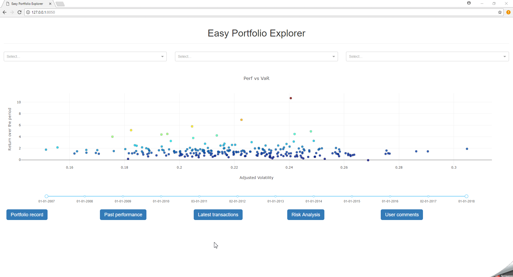

# Easy Portfolio Explorer

A Portfolio Explorer using [Dash by plotly](https://plot.ly/products/dash/).

The application will generate random portfolio and compute key performance and key metrics.
By default portffolio are composed of a number of stocks between 10 and 50. Individual stock weights are also random. 

The application was initialy designed to be used by portfolio managers or more broadly managers. 
Each point on the main scatter plot represents a portfolio. 
One can access additional information for each portfolio by first clicking on a single point and then navigating through the bottom tab. 




## Installation


```sh
$ git clone git+https://github.com/jblemoine/EasyPortfolioExplorer
$ cd EasyPortfolioExplorer
$ pip install -r requirements.txt
```

## Usage

```python
from EasyPortfolioExplorer import EasyCallbacks, MarketData


#Set market data, using a quandl api key.

market_data = MarketData(
    
    # default hdf5 file
    file="data/market_data.h5",
    
    # default table 
    key='market_close',
    
    # start date 
    date_min='20070101',
    
    # end date 
    date_max='20180309',
    
    # Your quandl key. You can get your free api key from here https://www.quandl.com/. 
    quandl_api_key='xxxxxxxxxxxxxxx')


# Create a custom app 
app = EasyCallbacks(
        
        # base url 
        url_base_pathname='/',
        
        # optional debug mode
        debug=True,
        
        # set the market data
        market_data=market_data,
        
        # set ptf number to display. Limited to 2000, due to performance issue.
        ptf_number=1000,
        
        # data to be used in dropdowns. Must be either 'id', 'Fund_manager', 'Client_name', 'Type', 'Creation_date'
        labels=['Fund_manager', 'Type', 'id']
    ).app
   
# launch the app
if __name__ == '__main__':
    app.run_server(
    )
```

## Running the tests

```sh
$ pytest

```
## Authors

 **Jean-Baptiste Lemoine**

## License

This project is licensed under the MIT License - see the [LICENSE.md](raw/LICENSE.md) file for details

## Acknowledgments

* https://github.com/refinery-platform/heatmap-scatter-dash
